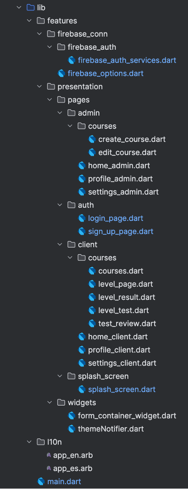

# Coursefy

**Coursefy** es una aplicación multiplataforma educativa diseñada para empresas que desean ofrecer formación a sus empleados de forma atractiva y estructurada. Gestiona la creación y seguimiento de cursos, con diferentes niveles, contenidos explicativos y pruebas tipo test. Está diseñada para 2 tipos de usuarios: administradores y clientes. La app permite a los administradores crear cursos compuestos por niveles, contenido teórico, archivos descargables y tests. Los empleados (usuarios cliente) pueden acceder a estos cursos, avanzar progresivamente y hacer un seguimiento de su progreso.

Está desarrollada en el framework de Flutter con Dart y respaldada por Firebase (Firestore, Auth y Storage).


## Tabla de contenidos

- [Características principales](#características-principales)
- [Funcionalidades destacadas por rol](#funcionalidades-destacadas-por-rol)
  - [Administrador](#administrador)
  - [Cliente](#cliente)
- [Estructura del proyecto](#estructura-del-proyecto)
- [Instalación en dispositivos reales](#instalación-en-dispositivos-reales)
  - [Descargar la aplicación en Android](#descargar-la-aplicación-en-android)
  - [Descargar la aplicación en iOS](#descargar-la-aplicación-en-ios)
- [Clonar el repositorio](#clonar-el-repositorio)
- [Instalación y configuración del proyecto](#instalación-y-configuración-del-proyecto)
- [Dependencias Principales](#dependencias-principales)
- [Buenas Prácticas](#buenas-prácticas)
- [Licencia](#licencia)


## Características principales

- **Gestión de usuarios**: autenticación con Firebase Auth y almacenamiento de datos en Firestore.  
- **Roles diferenciados**: administradores y clientes con interfaces y permisos distintos.  
- **Creación de cursos**: permite a los administradores crear cursos con múltiples niveles, añadir contenido y subir archivos PDF, TXT o HTML para cada nivel.  
- **Tests por niveles y finales**: tests de preguntas tipo test tanto por nivel como test final.  
- **Visualización de archivos**: los usuarios pueden ver o descargar archivos adjuntos en cada nivel.  
- **Sistema de progreso**: desbloqueo progresivo de niveles según el avance del usuario.  
- **Soporte multilenguaje**: disponible en español e inglés.  
- **Tema claro/oscuro**: el usuario puede elegir el modo de visualización desde ajustes.  
- **Gestión de cuentas**: cambio de contraseña y eliminación de cuenta.  
- **Tags y filtros**: los cursos pueden tener etiquetas para facilitar la búsqueda y filtrado.


## Funcionalidades destacadas por rol

### Administrador

- Crear cursos con niveles, tests y archivos adjuntos.
- Eliminar su cuenta o cambiar contraseña.
- Cambiar el idioma y el tema de la app.
- Ver y gestionar los cursos creados.


### Cliente

- Consultar cursos, niveles y realizar tests.
- Desbloquear niveles según su progreso.
- Visualizar archivos adjuntos o descargarlos.
- Consultar su progreso y perfil.
- Cambiar idioma, tema y gestionar su cuenta.


## Estructura del proyecto

En la siguiente imagen se detalla la estructura del proyecto, que refleja directamente la organización de clases.




## Instalación en dispositivos reales

### Descargar la aplicación en Android
En el siguiente enlace se encuentra la APK para instalar Coursefy en Android

[APK](https://github.com/miriamjimenezj/coursefy/tree/main/APK)

Dentro de esta carpeta podemos encontrar 4 versiones diferentes de la APK. Por defecto se debe instalar el archivo app-release.apk. En caso de no funcionar, se han generado las siguientes APKs:

- app-arm64-v8a-release.apk -> Destinada a dispositivos modernos con procesadores ARM de 64 bits.
- app-armeabi-v7a-release.apk -> Destinada a dispositivos más antiguos con procesadores ARM de 32 bits.
- app-x86_64-release.apk -> Destinada a dispositivos y emuladores con arquitectura Intel x86_64.

#### Pasos para instalar la APK:

1. **Descarga el archivo** desde el enlace anterior directamente en tu dispositivo Android.

2. Una vez descargado, abre el archivo `.apk`. Es posible que debas ir a la carpeta **Descargas** o usar un gestor de archivos.

3. Si es la primera vez que instalas aplicaciones fuera de Google Play, Android te pedirá **habilitar la instalación de apps desde fuentes desconocidas**:

   - Se abrirá una advertencia, pulsa en **Ajustes**.
   - Activa la opción **Permitir desde esta fuente**.
   - Vuelve atrás e inicia de nuevo la instalación.

4. Pulsa en **Instalar** y espera a que finalice el proceso.

5. Una vez instalada, pulsa en **Abrir** para empezar a usar Coursefy.

> Requisitos mínimos:
> - Sistema operativo Android 8.0 o superior.
> - Conexión a internet para acceder a los contenidos de los cursos.

---

### Descargar la aplicación en iOS
Actualmente, la instalación de Coursefy en dispositivos iOS se realiza de forma local desde un Mac, conectando el iPhone por cable y utilizando Android Studio junto con Xcode. Este método es útil durante el desarrollo o para pruebas internas sin necesidad de publicar la app en App Store.

#### Pasos a seguir para la instalación en un iPhone

#### 1. **Tener el proyecto instalado en el mac**
Para ver cómo instalar y configurar el proyecto en el ordenador, revisar la sección: [Instalación y configuración del proyecto](#instalación-y-configuración-del-proyecto)

#### 2. **Conecta el iPhone al Mac mediante cable USB**

- Desbloquea el iPhone y acepta el mensaje de confianza si aparece ("¿Confiar en este ordenador?").
- El dispositivo debe aparecer disponible como destino de ejecución en Android Studio o Xcode.

#### 3. **Activa el modo desarrollador en el iPhone**

Desde iOS 16, Apple requiere activar manualmente el modo desarrollador para poder ejecutar apps instaladas desde Xcode:

1. En el iPhone, ve a **Ajustes > Privacidad y seguridad > Modo desarrollador**.
2. Activa la opción **Modo desarrollador**.
3. El dispositivo se reiniciará.
4. Tras el reinicio, confirma el aviso que aparece en pantalla para activar el modo desarrollador.

#### 4. **Abre el proyecto en Android Studio (o VS Code)**

Asegúrate de tener configurado tu entorno Flutter correctamente. Ejecuta el siguiente comando desde la terminal.

```
flutter doctor
```

Verifica que Xcode y los dispositivos estén bien configurados.

#### 5. **Abre el proyecto iOS en Xcode**
1. Abre la carpeta ios/ del proyecto con Xcode.
2.	Ve a Signing & Capabilities dentro del proyecto.
3.	Selecciona tu Team (debe estar asociado a tu Apple ID con rol de desarrollador).
4.	Asegúrate de que el bundle identifier sea único.

#### 6. **Generación automática de certificados y perfil de aprovisionamiento.**

Xcode se encargará de generar:

- El certificado de desarrollador (Development certificate).
- El perfil de aprovisionamiento (Provisioning profile).

Si no tienes cuenta de desarrollador de pago (99$/año), puedes usar una cuenta gratuita de Apple, aunque con limitaciones: la app solo se instalará durante 7 días y debe firmarse de nuevo después.

#### 7. **Construir y ejecutar la app.**

- Desde Android Studio:
  - Asegúrate de que el dispositivo iOS esté seleccionado como destino.
  - Ejecuta el proyecto (flutter run o con el botón Run ▶️).

- Desde Xcode:
  - Pulsa el botón de play en la parte superior para compilar e instalar la app en el iPhone.

#### 8. **Confiar en el desarrollador (si es necesario).**

En algunos casos, si usas cuenta gratuita:
	
  1.	En el iPhone, ve a Ajustes > General > VPN y gestión de dispositivos.
	
  2.	Pulsa sobre tu perfil de desarrollador y selecciona Confiar.

## Clonar el repositorio

```bash
git clone https://github.com/tu_usuario/coursefy.git
cd coursefy
```

## Instalación y configuración del proyecto

### Requisitos previos
- Instalar Flutter: https://docs.flutter.dev/get-started/install/macos/mobile-ios 
-	Instalar Dart: https://dart.dev/get-dart 
-	Instalar Visual Studio Code y añadir las extensiones necesarias de flutter y dart: https://code.visualstudio.com 
-	Instalar Android Studio y editar el SDK Manager tal y como se muestra en la documentación: https://developer.android.com/studio
- Instalar XCode

Se debe ejecutar 
```
flutter doctor
````
para comprobar que se ha instalado todo correctamente.


### 1. Configura Firebase

- Crea un proyecto en [Firebase Console](https://console.firebase.google.com/).
- Descarga los archivos `google-services.json` (Android) y/o `GoogleService-Info.plist` (iOS) y colócalos en sus carpetas correspondientes.
- Habilita las secciones de: Authentication (Email/Password), Firestore Database y Storage.

### 2. Configura las reglas de Firestore y Storage

#### Firestore

```js
rules_version = '2';
service cloud.firestore {
  match /databases/{database}/documents {

    match /config/admin_settings {
  		allow read: if true;
		}

    match /users/{userId} {
      allow read, write: if request.auth != null;
    }

  match /courses/{courseId} {
  	allow read: if request.auth != null;
  	allow update, delete: if request.auth != null && request.auth.uid == resource.data.createdBy;
  	allow create: if request.auth != null && request.resource.data.createdBy == request.auth.uid;
	}
  
 match /course_progress/{docId} {
  allow read: if request.auth != null;
  allow write: if request.auth != null && request.auth.uid == request.resource.data.userId;
}
  }
}

 service firebase.storage {
  match /b/{bucket}/o {
    match /courses/{courseId}/{allPaths=**} {
      allow read, write: if request.auth != null;
    }
  	}
  }
```

#### Storage

```js
service firebase.storage {
  match /b/{bucket}/o {
    match /course_files/{allPaths=**} {
      allow read: if true;
      allow write: if request.auth != null;
    }
  }
}
```

### 3. Instala las dependencias

Para instalar las dependencias debes ejecutar:

```
flutter pub get
```

### 4. Ejecuta la aplicación

**Modo debug:**

```
flutter run
```

**Construir APK (Android):**

```
flutter build apk --release
```

**Construir para iOS:**

```
flutter build ios --release
```

### 5. Configuración adicional

- Si añades nuevas traducciones, ejecuta:

```bash
flutter gen-l10n
```

- Si tienes problemas con dependencias, ejecuta:

```
flutter clean
flutter pub get
```

## Dependencias principales

- `firebase_core`
- `cloud_firestore`
- `firebase_auth`
- `firebase_storage`
- `file_picker`
- `provider`
- `syncfusion_flutter_pdfviewer`
- `url_launcher`
- `flutter_localizations`
- `google_sign_in`


## Buenas prácticas

- Utiliza los archivos de traducción `.arb` para mantener la app bilingüe.
- Usa `Provider` para la gestión global del tema.
- Guarda los archivos adjuntos en Firebase Storage bajo la ruta `course_files/`.


## Licencia

Este proyecto está licenciado bajo la licencia MIT. Esto significa que puedes utilizar, copiar, modificar y distribuir este software con libertad, siempre que se conserve el aviso de copyright original.

```
MIT License

Copyright (c) 2025 Miriam Jiménez

Permission is hereby granted, free of charge, to any person obtaining a copy
of this software and associated documentation files (the "Software"), to deal
in the Software without restriction, including without limitation the rights 
to use, copy, modify, merge, publish, distribute, sublicense, and/or sell 
copies of the Software, and to permit persons to whom the Software is 
furnished to do so, subject to the following conditions:

The above copyright notice and this permission notice shall be included in 
all copies or substantial portions of the Software.

THE SOFTWARE IS PROVIDED "AS IS", WITHOUT WARRANTY OF ANY KIND, EXPRESS OR 
IMPLIED, INCLUDING BUT NOT LIMITED TO THE WARRANTIES OF MERCHANTABILITY, 
FITNESS FOR A PARTICULAR PURPOSE AND NONINFRINGEMENT. IN NO EVENT SHALL THE 
AUTHORS OR COPYRIGHT HOLDERS BE LIABLE FOR ANY CLAIM, DAMAGES OR OTHER 
LIABILITY, WHETHER IN AN ACTION OF CONTRACT, TORT OR OTHERWISE, ARISING FROM, 
OUT OF OR IN CONNECTION WITH THE SOFTWARE OR THE USE OR OTHER DEALINGS IN 
THE SOFTWARE.
```

